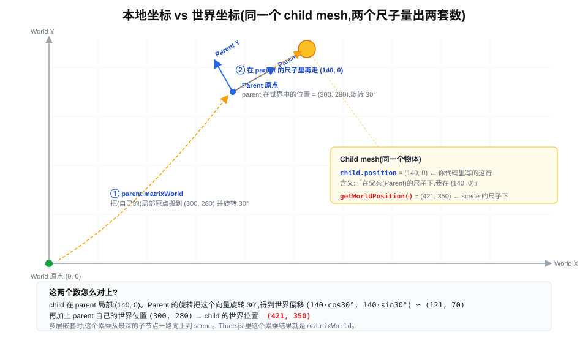
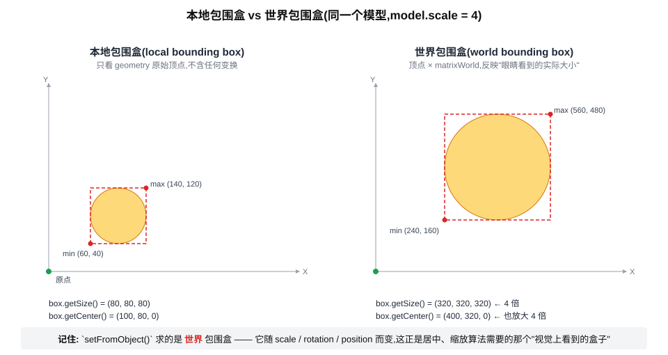

# 世界坐标 vs 本地坐标(world space vs local space)

> 缘起:`src/three/lib/centerModelToOrigin.js` 用 `Box3.setFromObject(model)` 求出来的是「世界」包围盒,而 `bounding-box.svg` 只展示了一个具体应用——这份文档先讲清楚「世界坐标」「本地坐标」这对**根概念**到底是什么。



## 1. 为什么同一个物体会有两套坐标?

3D 引擎里每个物体都有两个坐标含义:

- **本地坐标(local / object space)**:在「父亲」的尺子下量出来的位置。GLTF 文件里的顶点缓冲区、你写的 `mesh.position = ...` 都是这个空间里的值。
- **世界坐标(world space)**:在场景根 `scene` 的尺子下量出来的位置,是引擎渲染时实际用的、屏幕上「看得到」的那一套。

两者之所以经常不一致,是因为场景是一棵**树**:每个物体被挂在某个父物体上,父物体又被挂在更上层的父物体上。每个物体只记录「我相对父亲的偏移、旋转、缩放」(也就是它的 `position` / `rotation` / `scale`),引擎渲染时把整条父子链上的变换全部累乘,才能算出它**最终落在世界的哪一格**。

上面那张图里:

- `child.position = (140, 0)` —— 你写的这行,是在 **Parent 的尺子下**说话
- 但屏幕上 child 出现在世界 `(421, 350)` —— 因为 Parent 自身的位置 `(300, 280)` 和旋转 `30°` 把那个 `(140, 0)` 推到了别的地方

两个数都对,看你站在谁的尺子下问。

## 2. 本工程的真实层级

来看一颗行星(以水星为例)在场景树里的样子:

```
scene                                ← 世界原点 (0, 0, 0)
└── mercuryAxis                      rotation.x = degToRad(dipAngle)   ← 轨道倾角层
    └── mercuryRoot                   position = (x, 0, z)              ← 公转层
                                      orbitRad 每帧累加;
                                      x、z 由 orbitRad 通过椭圆参数方程算出
                                      (x = a·(cos(rad) - e),z = b·sin(rad))
        └── mercurySpin               rotation.y += spinRad             ← 自转层
            └── mercuryModel          position = (0, 0, 0)              ← GLTF 模型本身
                                      scale = uniform
```

> 注意 `mercuryRoot` 层用的是 **改 `position`**,不是 `rotation.y`。因为轨道是椭圆而不是正圆,每一帧都用 `orbitRad` 通过椭圆参数方程重新算出 `(x, z)` 直接赋给 `root.position`(详见 [行星椭圆轨道.md](./行星椭圆轨道.md))。如果是正圆轨道,确实可以靠 `root.rotation.y` 旋转一个偏移子节点来实现——但椭圆下这个等价关系不成立。

那么问:**水星模型在哪?**

- `mercuryModel.position`(本地)= `(0, 0, 0)`,意思是「在 `mercurySpin` 的尺子下我在原点」
- 实际在世界看到的位置,要把 `axis → root → spin` 三层 transform 累乘后施加到 `(0, 0, 0)` 上。结果是一颗每帧位置都不同(因为 `mercuryRoot.position` 在变)的水星

所以:**「模型 position 是 (0, 0, 0)」绝对不等于「模型在世界原点」**。这是初学者最容易踩的坑。

## 3. Three.js 怎么记录这两套?

|                    字段                    |                          含义                          |       谁负责写        |
|:------------------------------------------:|:------------------------------------------------------:|:---------------------:|
| `object.position` / `.rotation` / `.scale` |         **本地**的平移 / 旋转 / 缩放(相对父亲)         |      你写的代码       |
|              `object.matrix`               |             本地 4x4 矩阵,= 上面三者的合成             | 引擎自动从 P/R/S 重建 |
|            `object.matrixWorld`            | **世界** 4x4 矩阵,= `parent.matrixWorld × this.matrix` | 引擎自动逐级累乘到根  |

记住这个分工:**你只能直接「写」本地的;世界的是引擎根据树结构「算给你读」的**。

如果你只想读世界值,有专门的 API:

- `object.getWorldPosition(target)` —— 把世界位置写到 `target` 这个 Vector3 上
- `object.getWorldQuaternion(target)`
- `object.getWorldScale(target)`
- `object.getWorldDirection(target)`

它们内部都依赖 `matrixWorld`。

## 4. `matrixWorld` 不是实时的

每帧 `renderer.render(scene)` 之前,Three.js 会自动调用 `scene.updateMatrixWorld()`,把整棵树的 `matrixWorld` 全部刷新一次。所以**渲染那一刻**,大家的 `matrixWorld` 都是最新的。

但如果你**在中间手动改了 `position`,然后立刻想读 `matrixWorld`**——它还是上一帧渲染时刷新的旧值,引擎不会盯着你看。这种时候必须手动:

```js
object.updateMatrixWorld(true)  // 第二个参数:连同所有子树一起刷新
```

`centerModelToOrigin.js:8` 第一行就是干这个的:

```js
model.updateMatrixWorld(true)              // ① 强制刷新世界矩阵
const box = new THREE.Box3().setFromObject(model)  // ② 用世界矩阵求世界包围盒
```

少了第 ① 步,第 ② 步算出来的可能是没经过最新变换的「错盒子」。

## 5. 回到 `centerModelToOrigin`

完整源码就 4 行有效语句,逐行解读:

```js
model.updateMatrixWorld(true)                            // ① 见上节
const box = new THREE.Box3().setFromObject(model)        // ② 求世界包围盒
const center = new THREE.Vector3()
box.getCenter(center)                                    // ③ 世界 AABB 的中心点
model.position.sub(center)                               // ④ 用本地 position 把模型反向挪
```

> **名词:AABB**
>
> **AABB** = Axis-Aligned Bounding Box,**轴对齐包围盒**——盒子的六个面永远平行于坐标轴(X / Y / Z),**不跟物体一起旋转**。Three.js 的 `THREE.Box3` 就是 AABB,所以 `setFromObject()` 返回的盒子,边永远平行于世界 X / Y / Z 轴。
>
> 对比概念是 **OBB**(Oriented Bounding Box,定向包围盒):会跟物体一起转,贴合更紧但计算贵。AABB 在物体斜着摆时会比 OBB 大(角上有空隙),代价是「包不紧」;好处是**算几何中心、做碰撞检测、视锥裁剪都很快**。
>
> `centerModelToOrigin` 只需要中心点(中心点在 AABB 和 OBB 下数值上是同一个几何中心),所以 AABB 完全够用。

**第 ② 步——`Box3.setFromObject()` 的内部行为**:遍历模型每一个顶点,用 `matrixWorld` 把顶点从本地坐标变换到世界坐标,再求最小 / 最大值。所以它返回的盒子是「在世界尺子下量出来的盒子」——也就是肉眼看到的那个外接矩形。

下图展示同一个模型在 `scale = 4` 之下,「本地包围盒」和「世界包围盒」的差距:



- **左边「本地包围盒」**:只看 geometry 缓冲区里的原始顶点,不含任何变换。模型尺寸 `(80, 80, 80)`,中心 `(100, 80, 0)`——这是模型「出厂」时自带的几何信息,`geometry.boundingBox` 返回的就是这个。
- **右边「世界包围盒」**:把每个顶点先乘一遍 `matrixWorld`(里面包含了 `scale = 4`、各种 rotation、position 等)再求 min/max。模型尺寸变成 `(320, 320, 320) = 4 × 本地尺寸`,中心 `(400, 320, 0)` 也按比例放大——这才是屏幕上肉眼实际看到的那个盒子。

`Box3.setFromObject(model)` 返回的就是右边这个 **视觉外观对应的盒子**。所以 `centerModelToOrigin` 第 ③ 步算出的 `center`,代表的是「肉眼看到的几何中心」——把它从本地 `position` 上减掉,模型的实际显示位置就居中到原点了。

> 反过来想:如果用左边的「本地包围盒中心」`(100, 80, 0)` 去减 `model.position`,模型在 `scale = 4` 后视觉上仍然偏离原点 ——因为你减的尺子是 1:1 本地的,而显示用的尺子是 1:4 放大后的。**尺子对不上,居中就不准。**

**第 ④ 步的小巧妙**:**为什么把世界空间的 `center` 直接减到本地 `model.position` 上能成立?**

- 这个函数被调用的时机(见 `sun.js:176` / `planet/planet.js:91`):**GLTF 刚加载完,model 还没被挂到任何父 Group 上**,`model.parent` 默认是 `null`(或者一个单位变换的根)。
- 此时模型本身**没有任何祖先变换**,本地空间和世界空间的尺子完全重合,世界中心和本地坐标值数值上相等,可以直接当本地偏移用。

这个小巧妙也意味着一条隐藏约束:**`centerModelToOrigin()` 必须在挂到层级之前调用**。一旦挂上去且祖先有非单位变换,这个直接相减就会歪掉,你减的是世界数,但加的位置最终还要被祖先的变换再乘一遍。

## 6. 容易混淆的几个点

1. **「模型在 (0, 0, 0)」≠「模型在世界原点」**——前者是 local,后者要看 `getWorldPosition()`。
2. **`scale` 是相对父亲的**——祖先有 `scale = 2`,这里又写 `scale = 3`,世界尺度是 6。
3. **包围盒有两种**:
   - `box.setFromObject(obj)`:世界 AABB。本工程实际用的就是这个。
   - `geometry.boundingBox`:本地 AABB,纯顶点缓冲区,**不含**任何变换。
4. **`matrixWorld` 不会跟手**:你刚改完 `position`,下一行立刻读 `matrixWorld` 是旧值。要么先 `updateMatrixWorld(true)`,要么等下一帧渲染。

## 7. 小结

- **本地坐标**:相对父节点,你写 `position` / `rotation` / `scale` 改的就是这个
- **世界坐标**:相对场景根,引擎根据父子链自动累乘 `matrix` 算出来
- 想读世界值:用 `getWorldPosition()` / `getWorldQuaternion()` / `getWorldScale()`,或先 `updateMatrixWorld()` 再读 `matrixWorld`
- `Box3.setFromObject()` 求的是世界包围盒——视觉外观的那个盒子
- `centerModelToOrigin` 利用「挂载前 local ≈ world」这个时机点,把世界中心当本地偏移直接用——所以**调用顺序敏感**,必须在挂到父 Group 之前用
