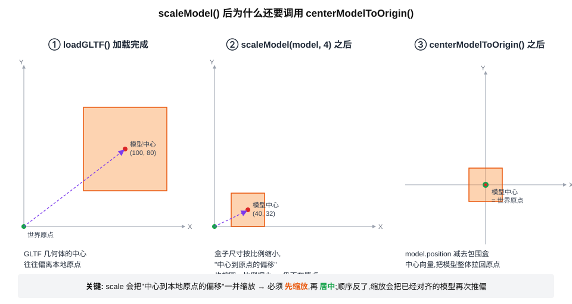

# 为什么 `scaleModel` 之后还要 `centerModelToOrigin`

> 缘起:`planet/planet.js` 和 `sun.js` 加载完模型后,**先调 `scaleModel(...)` 再调 `centerModelToOrigin(...)`**。这两步是配合的——这份文档讲清楚为什么要分两步、为什么顺序不能反。



## 1. 出发点:GLTF 模型的"中心"通常不在本地原点

3D 美术做模型时,本地坐标系的原点 `(0, 0, 0)` 往往不是模型的几何中心。它可能是脚底、可能是某个建模锚点、也可能是软件随手摆的位置。所以从 GLTF 加载完一个模型之后,**它的几何包围盒中心很可能远离 `(0, 0, 0)`**——这就是图中 ① 的样子,中心在 `(100, 80)`,不是世界原点。

## 2. `scaleModel(model, scaleSize)` 做了什么

`src/three/lib/scaleModel.js` 的核心两行:

```js
const scale = scaleSize / maxDim
model.scale.setScalar(scale)
```

它根据当前包围盒的最长边算出一个比例系数,然后把 `model.scale` 设成这个系数,让**模型的最长边等于 `scaleSize`**。这一步**只改 `model.scale`,完全不动 `model.position`**。

效果:模型整体按比例缩放——**包括"中心到本地原点的偏移"也被一并缩放**。如果原中心在 `(100, 80)`,缩放系数算下来是 `0.4`(图中假设的),那么缩放后中心变成 `(40, 32)`(图 ②)——**仍然不在原点**,只是按比例近了一些。

## 3. `centerModelToOrigin(model)` 做什么

`src/three/lib/centerModelToOrigin.js`:

```js
model.updateMatrixWorld(true)
const box = new THREE.Box3().setFromObject(model)
const center = box.getCenter(new THREE.Vector3())
model.position.sub(center)
```

求出当前**世界包围盒**的中心,把 `model.position` 沿这个 center 向量反向挪一段。挪完之后,模型的视觉几何中心就和世界原点重合了(图 ③)。

> `setFromObject()` 求的是世界包围盒——这一步会反映此时已经设好的 `model.scale`。也就是说 center 求的是「**缩放后**的中心位置」,这点是后面讨论顺序的关键。世界包围盒的概念详见 [世界坐标与本地坐标.md](./世界坐标与本地坐标.md)。

## 4. 为什么必须先缩放、再居中?反过来不行吗?

反过来——**先 center,再 scale**——会出问题。设原始包围盒中心(本地空间)为向量 `c`,缩放系数为 `s`(假设 ≠ 1)。

**情况 A:先 scale,再 center(正确)**

|         步骤          | `model.scale` | `model.position` |   世界包围盒中心   |
|:---------------------:|:-------------:|:----------------:|:------------------:|
|         起始          |       1       |   `(0, 0, 0)`    |        `c`         |
|     `scaleModel`      |      `s`      |   `(0, 0, 0)`    |       `s·c`        |
| `centerModelToOrigin` |      `s`      |      `-s·c`      | `s·c - s·c = 0` ✅ |

**情况 B:先 center,再 scale(错误)**

|         步骤          | `model.scale` | `model.position` |     世界包围盒中心     |
|:---------------------:|:-------------:|:----------------:|:----------------------:|
|         起始          |       1       |   `(0, 0, 0)`    |          `c`           |
| `centerModelToOrigin` |       1       |       `-c`       |      `c - c = 0`       |
|     `scaleModel`      |      `s`      |       `-c`       | `s·c - c = (s-1)·c` ❌ |

最后一行:`world_center = scale × local_center + position = s·c + (-c) = (s-1)·c`,在 `s ≠ 1` 时不为零。

直觉解释:**`model.scale` 缩放的是模型的几何顶点(也就是 `c` 这个向量),但不缩放 `model.position`**。如果你先 center,把"几何中心"塞进 `model.position` 抵消掉了——但下一步 scale 把几何中心 `c` 缩成了 `s·c`,而抵消用的 `model.position = -c` 没跟着变,两者不再匹配,偏移就冒回来了。

## 5. 为什么不一次性算好,合二为一?

理论上可以——把"目标尺度"和"中心偏移"在一个函数里同时算。但工程上分两步好处更多:

- **可组合**:有些场景只想缩放、不想居中(比如保留模型脚底锚点),只调 `scaleModel`;反之也成立
- **可调试**:出 bug 时,先看 ① loadGLTF 后的 box,再看 ② scale 后的 box,再看 ③ center 后的 box——哪一步偏掉一目了然
- **职责清晰**:`scaleModel` 只关心 size,`centerModelToOrigin` 只关心 position;两个函数各自的代码都很短

## 6. 调用约定

`planet/planet.js:89-91` 与 `sun.js:175-176` 的固定调用顺序:

```js
scaleModel(model, config.scale)            // 先缩放
centerModelToOrigin(model)                 // 再居中
// (此时再做 spin.add(model) / sunRoot.add(model) 等挂载)
```

并且:**两步都必须在挂到任何父 Group 之前完成**。原因见 [世界坐标与本地坐标.md](./世界坐标与本地坐标.md) 第 5 节—— `centerModelToOrigin` 利用「挂载前 local ≈ world」这个时机做了简化,挂到父级之后这条捷径就失效了。

## 7. 小结

- GLTF 模型的几何中心通常**不在本地原点**——美术建模习惯决定的
- `scaleModel` 只改 `model.scale`,不改 `position`——缩放后中心仍偏离原点(只是按比例近了)
- `centerModelToOrigin` 用**世界**包围盒中心反向偏移 `model.position`,把模型拉回原点
- **必须先 scale 再 center**:scale 会缩放本地中心向量 `c`,而 `position` 不受 scale 影响,顺序反了会让 `position` 抵消的是"未缩放的 c",留下 `(s-1)·c` 的偏差
