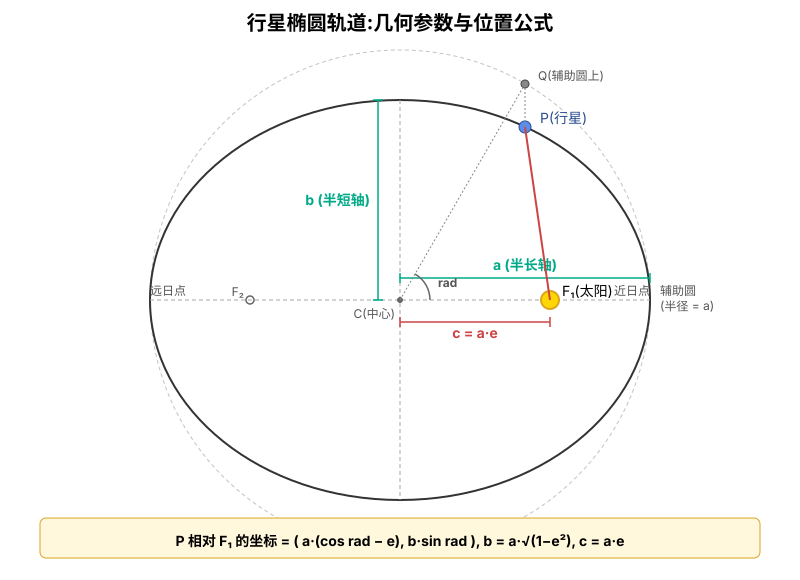

# 行星椭圆轨道:几何与位置公式

> 缘起:`src/three/planet/helper/position.js` 的 `calcOrbitalGroupPosition()` 用三行公式算出行星在轨道上的位置:
>
> ```js
> const b = semiMajorAxis * Math.sqrt(1 - eccentricity * eccentricity)
> const x = semiMajorAxis * (Math.cos(rad) - eccentricity)
> const z = b * Math.sin(rad)
> ```
>
> 这份文档讲清楚:`b` 是什么,公式里那个突兀的 `- e` 从哪来,`rad` 到底是什么角度。



## 1. 出发点:Kepler 第一定律

> **行星沿椭圆轨道运行,太阳位于椭圆的一个焦点上(不是中心)**。

椭圆有 **2 个焦点**(F₁、F₂),不像圆只有 1 个圆心。太阳在 F₁,F₂ 是空的(没有任何天体)。这是椭圆轨道和"圆形轨道"最关键的差异——后面所有公式的"古怪之处"(那个 `- e`)都来源于这一条。

## 2. 椭圆的 4 个几何参数

|         参数          |       含义       |                  几何位置                   |
|:---------------------:|:----------------:|:-------------------------------------------:|
| `a` (semi-major axis) |      半长轴      |              中心 C 到长轴端点              |
| `b` (semi-minor axis) |      半短轴      |              中心 C 到短轴端点              |
|          `c`          | 中心到焦点的距离 |                   C 到 F₁                   |
|  `e` (eccentricity)   |      离心率      | `e = c/a`,衡量"扁不扁"。e=0 是正圆,e→1 越扁 |

代码里直接用了 `semiMajorAxis`(a)和 `eccentricity`(e),这两个就够了——其他都能推导出来。

## 3. 为什么 `b = a · √(1 − e²)`?(代码里的 b)

椭圆的一个**定义性等式**:

```
b² + c² = a²
```

推导:椭圆的几何定义是「任意点到两焦点距离之和 = 2a」。短轴顶点关于两焦点对称,到每个焦点的距离都是 a。这构成一个直角三角形——c 是底,b 是高,a 是斜边,所以 `b² + c² = a²`。

代入 `c = a·e`:

```
b² = a² − c² = a² − (a·e)² = a² · (1 − e²)
b  = a · √(1 − e²)
```

这正是 `position.js` 第 23 行做的事:

```js
const b = semiMajorAxis * Math.sqrt(1 - eccentricity * eccentricity)
```

**所以 `b` 在代码里就是椭圆的半短轴**,由 a 和 e 推出来,不必单独存储。

## 4. 椭圆的参数方程(以中心为原点)

最基本的椭圆参数方程,**以中心 C 为原点**:

```
x = a · cos(t)
y = b · sin(t)
```

其中 `t` 从 0 到 2π 走一圈。

直观验证:

|  t   | (x, y)  |    位置    |
|:----:|:-------:|:----------:|
|  0   | (a, 0)  | 长轴右端点 |
| π/2  | (0, b)  | 短轴上端点 |
|  π   | (−a, 0) | 长轴左端点 |
| 3π/2 | (0, −b) | 短轴下端点 |

✓ 一圈下来正好画出椭圆。

## 5. 把焦点移到原点(关键的那个 `- e`)

我们要的是「**太阳在原点**」——因为 Three.js 中场景的原点 (0, 0, 0) 就是太阳所在的位置。

太阳在 F₁(右焦点),F₁ 比中心 C 偏右 `c` 这么多。换句话说,如果让 F₁ 当原点,**中心 C 要往左移 c**,即 C 在 (−c, 0)。

把整个椭圆相应地左移 c:

```
x_focus = a · cos(t) − c     ← x 坐标全部减 c
z_focus = b · sin(t)          ← y 坐标不变
```

代入 `c = a·e`,提取公因子 a:

```
x = a · (cos(t) − e)
z = b · sin(t)
```

这就是 `position.js` 第 25-26 行:

```js
const x = semiMajorAxis * (Math.cos(rad) - eccentricity)
const z = b * Math.sin(rad)
```

公式里那个看起来"突兀"的 `- e`,其实就是**把焦点从 (a·e, 0) 平移到原点**的结果。

> **检验**:如果不需要太阳在原点(让 e=0),公式立刻退化为 `x = a cos t, z = b sin t`——和"以中心为原点的椭圆"完全一致。e=0 同时也意味着椭圆变成正圆(b = a),进一步退化为 `x = a cos t, z = a sin t`——标准圆方程。

## 6. 为什么是 `z` 不是 `y`(Three.js 约定)

Three.js 的世界坐标:**Y 轴朝上,XZ 平面是水平面**。

太阳系的轨道平面在视觉上是"水平的桌面",所以:

- 用 X、Z 描述行星在桌面上的位置
- Y 留给"上下浮动"(轨道倾角让它略微偏离 XZ 平面,但代码里 `y=0`,倾角放在外层 `axis.rotation.x` 上做)

所以纯 2D 椭圆方程的 (x, y) → 写到 3D 场景里就是 **(x, 0, z)**。

## 7. 那 `rad` 到底是什么角度?

这是**最容易误解**的地方:

> `rad` **不是**"从太阳看行星"的实际方位角。

参考示意图:在椭圆外画一个**辅助圆**(半径 = a,圆心 = C)。对椭圆上的任意一点 P,**它的正上方(同一 x)恰好在辅助圆上有一点 Q**。**`rad` 是 C 到 Q 的角度**(从 C 看辅助圆,不是从 F₁ 看椭圆)。

数学家给它起了个名字:**eccentric anomaly**(偏近点角,常记为 E)。

为什么用这个角而不是"从太阳看的真实角度"?——因为这样写出来的公式特别干净:

```
辅助圆上: Q = (a · cos E,  a · sin E)     ← 标准圆方程
椭圆上:   P = (a · cos E,  b · sin E)     ← 把 y 缩 b/a 倍
```

**椭圆就是把辅助圆的 y 轴整体压扁 `b/a` 倍而已**——这其实是椭圆的几何起源。

## 8. 一个不严谨但工程上"足够好"的简化

代码里:

```js
planet.orbitRad += planet.config.orbit.speed   // rad 线性增长
```

`rad`(也就是 eccentric anomaly E)**每帧匀速增加**——这是**简化**。

真实的 Kepler 运动满足**第二定律**:行星扫过的面积速度恒定 → 在近日点跑得快,远日点跑得慢。严格做法每帧应该:

1. 算 mean anomaly:`M = M₀ + n·t`(线性)
2. 解 Kepler 方程:`M = E − e·sin(E)`(超越方程,需 Newton 迭代)
3. 再用 `P = (a · (cos E − e), b · sin E)`

代码省了第 2 步,直接让 E 线性增长——本质相当于把"在 eccentric anomaly 上的角速度"当成常量。

### 8.1 误差有多大?

|         行星         |   离心率 e    |           视觉影响           |
|:--------------------:|:-------------:|:----------------------------:|
| 金星 / 地球 / 海王星 | 0.007 ~ 0.017 |          完全看不出          |
| 木星 / 土星 / 天王星 |  0.04 ~ 0.06  |            看不出            |
|         火星         |     0.093     |          几乎看不出          |
|         水星         |     0.21      | 仔细盯能感觉"近日点掠过略快" |

对**视觉演示型**项目,这个简化非常合算——省了一个迭代解超越方程的循环。如果将来要做严格的天文模拟,再补 Kepler 方程那一步即可(参考 Kepler equation 的 Newton 迭代法,通常 3-5 次迭代收敛到 1e-12 精度)。

## 9. 把代码再读一遍

```js
function calcOrbitalGroupPosition(rad, semiMajorAxis, eccentricity) {
    const b = semiMajorAxis * Math.sqrt(1 - eccentricity * eccentricity)
    //         ↑ 半短轴 b = a√(1−e²),由椭圆几何 b²+c²=a² 推出

    const x = semiMajorAxis * (Math.cos(rad) - eccentricity)
    //                          ↑          ↑
    //                          |          └ 这个 −e 是「把椭圆中心左移 c 让焦点落在原点」
    //                          └ rad 是辅助圆上的角度(eccentric anomaly)

    const z = b * Math.sin(rad)
    //         ↑ 把辅助圆的 y 轴压扁 b/a 倍 → 椭圆

    return {x, z}
    //      ↑ Three.js 用 XZ 作水平面,Y 留给上下
}
```

理解完后,这个函数读起来就和「x = r cos θ, y = r sin θ」那种圆方程一样直观——只是多了一个**焦点移位**和一个 **y 轴压扁**的步骤。

## 10. 要点提炼

- **Kepler 第一定律**:椭圆 + 太阳在焦点(不是中心)是一切公式的几何起点
- **椭圆 4 参数 a / b / c / e** 中只需存 `a` 和 `e`,其余推导:`c = a·e`,`b = a·√(1−e²)`
- **`- e` 来自焦点平移**:让太阳坐标 = (0,0,0),椭圆中心相应往左挪 c
- **椭圆的本质是"压扁的圆"**:把辅助圆的 y 轴乘以 `b/a` 即得椭圆 → 这就是 `b·sin(rad)` 的来历
- **`rad` 是 eccentric anomaly**(辅助圆上的角度),不是"从太阳看行星"的方位角
- **当前实现是简化版 Kepler**:rad 线性增长,跳过了 Kepler 方程迭代,对低离心率行星视觉无差