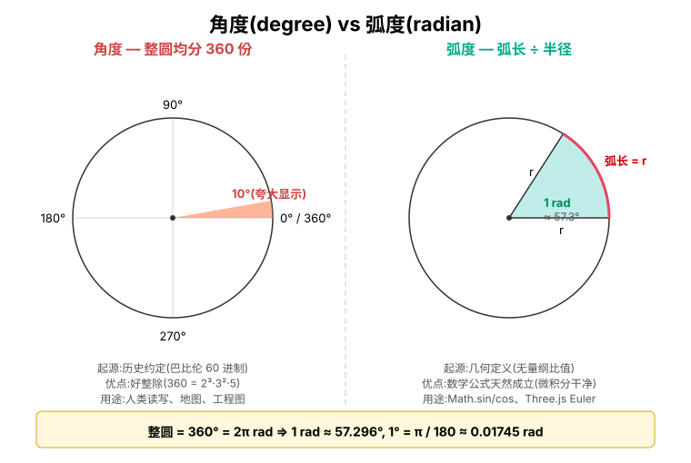

# 角度(degree)与弧度(radian)

> 缘起:`行星模块Review问题清单.md` 问题 ⑤ 提到 `orbitAngle` 的 JSDoc 注释把单位写成"角度",而代码里实际是"弧度"。这份文档讲清楚两者到底是什么、为什么有两种、项目里何时该用哪种。



## 1. 什么是「角度」

角度是**人为规定的**:把一整圈均分成 360 份,每份叫 1°。

为什么是 360 而不是 100、500?纯粹历史原因——巴比伦人用 60 进制,而 360 = 6 × 60,且 360 这个数字能被 1, 2, 3, 4, 5, 6, 8, 9, 10, 12 ... 整除,日常分割很方便(画地图、量地砖、做钟表)。

它是一个**任意选定的单位**——没有数学/物理上的必然理由非得是 360。

## 2. 什么是「弧度」

弧度是**几何上自然的定义**:

> 一个圆弧所对应的圆心角,等于"弧长除以半径"。

也就是说:

```
角度(弧度制) = 弧长 / 半径
```

看示意图右半边:画一段**长度恰好等于半径 r** 的弧,它对应的圆心角就是 **1 弧度**(1 rad)。

这个定义有个关键性质:**它是个比值,没有量纲**(长度 ÷ 长度)。这一点和"角度"很不一样——「度」其实是被附加上去的单位。

由这个定义直接推出:

- 整圆周长 = 2πr
- 整圆对应的弧度 = 2πr / r = **2π**
- 而整圆同时 = 360°
- 所以 **2π rad = 360°**
- 1 rad = 360° / (2π) ≈ **57.296°**
- 1° = π / 180 ≈ **0.01745 rad**

## 3. 为什么编程语言 / 数学公式都用弧度

不是约定俗成,是**数学本身**要求弧度。三个例子:

### 3.1 `Math.sin / cos / tan` 用弧度

```js
Math.sin(Math.PI / 2)   // 1     ✅ π/2 弧度 = 90°
Math.sin(90)            // 0.8939...  ❌ 把 90 当弧度处理,根本不是直角
```

原因:正弦的泰勒展开

```
sin(x) = x - x³/6 + x⁵/120 - x⁷/5040 + ...
```

只在 `x` 是弧度时成立。计算机底层就是用这个级数算的。

### 3.2 微积分天然要求弧度

```
d/dx sin(x) = cos(x)
```

这条公式只在 x 是弧度时成立。若用度,会变成

```
d/dx sin(x°) = (π/180) · cos(x°)
```

多出一个常数 π/180,所有微分公式都被污染。

### 3.3 旋转矩阵 / 四元数

Three.js 的 `Euler`、`Quaternion`,以及一切旋转、角速度运算,内部都是弧度。

## 4. 两种单位的分工

|                       |    角度    |        弧度         |
|:---------------------:|:----------:|:-------------------:|
|       谁能看懂        | 人类(直观) | 数学 / 计算机(自然) |
|         整圆          |    360°    |         2π          |
|         直角          |    90°     |         π/2         |
|  `Math.sin/cos` 接收  |     ❌     |         ✅          |
| Three.js 角度字段接收 |     ❌     |         ✅          |

**人写代码 / 看代码时用角度更方便,但传给数学库前必须先转成弧度。**

## 5. 项目里的对应

`config.js` 里两个字段不一样的原因正是这个分工:

```js
// dipAngle:写给人看的,所以用角度
{ orbit: { dipAngle: 7.0 } }       // 水星轨道倾角 7°
                                    //         ↑ 打开天文资料就是这个数字

// 实际用前转成弧度:
const radians = THREE.MathUtils.degToRad(7.0)   // ≈ 0.122 rad
group.rotation.x = radians                        // Three.js 只认弧度
```

而 `orbitAngle` 完全是**程序内部累积**的状态值,从来不显示给人看,更不会让人手填,直接用弧度更省事——每帧 `+= speed`,然后丢给 `Math.cos / sin` 算位置:

```js
// helper/revolution.js
planet.orbitAngle += planet.config.orbit.speed   // 弧度累加

// helper/position.js
const x = a * Math.cos(angle)                     // ← 这里传弧度才对
const z = b * Math.sin(angle)
```

如果注释写的是"角度",会有两个隐患:

1. 后人误读,以为里面存的是 0~360 的数,可能写出 `if (orbitAngle > 360)` 之类的错误判断
2. 拿这个值去做物理推算(比如算开普勒第二定律的扫掠面积)时,忘了它是弧度,会得到错误结果

所以 `orbitAngle` 的 JSDoc 严格写成 `(单位: 弧度)` —— 这是 `行星模块Review问题清单.md` 问题 ⑤ 要修的本质。

## 6. 何时用 `THREE.MathUtils.degToRad / radToDeg`

简单原则:

- 数据**写在配置文件 / 给用户看**的地方 → 用角度,展示前 `degToRad` 转一次
- 数据**只在程序内部流转**(累加、传函数、存状态)→ 直接用弧度,从头到尾不转

不要在循环里反复 `degToRad / radToDeg` 来回转——既浪费,也容易在某一步忘了转,错位。一个值在它生命周期的"边界"上转一次就够了。

## 7. 换算公式与一个常见误解

### 7.1 一个容易踩的坑

直觉上很容易写出这样的"换算":

```
弧度 = 角度 / 2π    ❌
```

代入 45° 验算:

```
45 / 2π ≈ 45 / 6.2832 ≈ 7.16
```

**直觉自检**:任何小于一整圈的角度,转成弧度后必然小于 2π ≈ 6.28。结果 7.16 已经超过 2π,说明公式错了。45° 的实际弧度是 **π/4 ≈ 0.785**,相差近 10 倍。

### 7.2 正确公式

记住这条**等式**:

```
360° = 2π rad
```

由它直接得到:

```
x° → 弧度 = x × (2π / 360) = x × (π / 180)
```

也就是**乘以 π/180**(不是除以 2π)。代入 45° 验证:

```
45 × π / 180 = π / 4 ≈ 0.785 rad   ✓
```

### 7.3 "占比"思路的正解

如果想用"占整圆比例"的直觉,要分两步:

```
第一步:45° 占整圆的多少 = 45 / 360 = 1/8
第二步:1/8 圈对应的弧度 = (1/8) × 2π = π/4   ✓
```

合并即 `x × (2π / 360) = x × (π/180)`。

之前 `÷ 2π` 错在:把"整圆是 2π"当成了**分母**,但 2π 是**整圆对应的弧度值**(分子那一头的标尺),真正的分母应该是"整圆对应的角度值",也就是 **360**。

### 7.4 双向公式

```
角度 → 弧度:乘以 π / 180
弧度 → 角度:乘以 180 / π
```

代码里直接用 Three.js 工具函数:

```js
THREE.MathUtils.degToRad(45)             // 0.785...
THREE.MathUtils.radToDeg(Math.PI / 4)    // 45
```

### 7.5 几个值得脑里记下的常用对照

| 角度 | 弧度 | 近似值 |
|:----:|:----:|:------:|
| 30°  | π/6  | 0.524  |
| 45°  | π/4  | 0.785  |
| 60°  | π/3  | 1.047  |
| 90°  | π/2  | 1.571  |
| 180° |  π   | 3.142  |
| 360° |  2π  | 6.283  |

熟悉这几个之后,代码里看到 `Math.PI / 6` 能立刻反应是 30°,看到 `Math.PI * 2` 是整圈,不用每次都换算。
